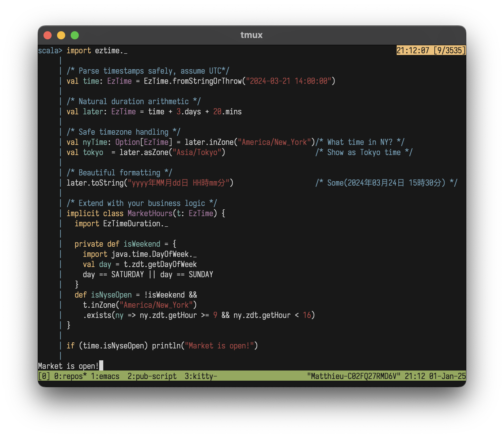

<p align="center">
  
</p>

#  eztime

**Time, made simple**

A minimalist, zero-dependency lib making time-based logic in Scala 🧈✨ smooth like butter.
Part of [d4](https://github.com/mattlianje/d4)


## Features
- Forces correct, type-safe time handling
- Duration arithmetic that reads like English
- Easily add your business logic
- Prevent timezone bugs
- Drop **EzTime.scala** into your project like a header-file

**EzTime** is on MavenCentral
```scala
"xyz.matthieucourt" % "eztime_2.13" % "0.0.3"
```

Try it in your repl:
```bash
scala-cli repl --dep xyz.matthieucourt:eztime_2.13:0.0.3
```

All you need:
```scala
import eztime._
```

## Core Concepts
### `EzTime`  
A wrapper around ZonedDateTime. You must instantiate an **EzTime** with the `fromString` or `fromStringOrThrow` smart constructors. This prevents invalidate date strings from ever entering your domain.
```scala
val myTime = EzTime.fromString("2024-01-01")
```
`now` always gives the current UTC time (no faffing about with server/local times):
```scala
EzTime.now
```

#### Duration DSL
Natural duration syntax, with no headscratching or thinking about pulling in ChronoUnits. You can use singular or plural of all units from `nano(s)` to `year(s)`
```scala
val laterTime = myTime + 3.days + 9.secs - 4.nanos
```

EzTime supports these duration units:

| Unit          | Variations                        | Example Usage |
|--------------|-----------------------------------|---------------|
| Nanoseconds  | nano, nanos, nanosecond(s)       | `5.nanos`     |
| Microseconds | micro, micros, microsecond(s)    | `10.micros`   |
| Milliseconds | milli, millis, millisecond(s)    | `100.millis`  |
| Seconds      | second, seconds, sec, secs       | `30.seconds`  |
| Minutes      | minute, minutes, min, mins       | `5.minutes`   |
| Hours        | hour, hours                      | `2.hours`     |
| Days         | day, days                        | `7.days`      |
| Weeks        | week, weeks                      | `2.weeks`     |
| Months       | month, months                    | `3.months`    |
| Years        | year, years                      | `1.year`      |

## Timezone Operations
**EzTime** provides 2 distinct ways to handle timezones:

1. `toZone`: Changes the wall clock time to show the same instant in a different time zone
```scala
/* It's 2 PM in London */
val londonTime = EzTime.fromString("2024-03-21T14:00:00+00:00[Europe/London]").get

/* Shows as 3 PM Paris time */
val parisWallTime = londonTime.inZone("Europe/Paris")
```

2. `atZone`: Keeps the same wall clock time but re-interprets the time zone
```scala
/* It's 2 PM in London */
val londonTime = EzTime.fromString("2024-03-21T14:00:00+00:00[Europe/London]").get

/* Shows as 2 PM in Paris */
val parisSameInstant = londonTime.asZone("Europe/Paris")
```

## Format Getters
EzTime provides comprehensive getters for common datetime formats:
```scala
val time = EzTime.fromStringOrThrow("2024-03-21T15:30:45+01:00[Europe/Paris]")

time.getYmdString             // "2024-03-21"
time.getYmdHmsString          // "2024-03-21 15:30:45"
time.getYmdHmsTzString        // "2024-03-21 15:30:45 +01:00"
time.getIsoString             // "2024-03-21T15:30:45"
time.getIsoTzString           // "2024-03-21T15:30:45+01:00"
time.getShortTimeString       // "15:30"
time.getTimeString            // "15:30:45"
time.getYearString            // "2024"
time.getMonthString           // "03"
time.getDayString             // "21"

// Component access
time.getYear                  // 2024
time.getMonth                 // 3
time.getDay                   // 21
time.getHour                  // 15
time.getMinute                // 30
time.getSecond                // 45
```


## Adding Business Logic and Formatters
**EzTime**'s extension system lets you encapsulate your domain specific time logic

```scala
object BusinessRules {
  implicit class TradingHours(val time: EzTime) {
    import eztime.EzTimeDuration._
    import java.time._

    def isWeekend: Boolean = {
      val day = time.zdt.getDayOfWeek
      day == DayOfWeek.SATURDAY || day == DayOfWeek.SUNDAY
    }
    
    def isNyseHours: Boolean = {
      if (isWeekend) false 
      else {
        val nyTime = time.inZoneOrThrow("America/New_York")
        val hour = nyTime.zdt.getHour
        hour >= 9 && hour < 16
      }
    }
    
    def nextBusinessDay: EzTime = 
      LazyList.iterate(time + 1.day)(_ + 1.day)
        .dropWhile(_.isWeekend)
        .head
  }
}
```

Then just use your business logic naturally as if it were baked into **EzTime**
```scala
import BusinessRules._

val now = EzTime.fromString("2024-03-21T12:30:00Z").get

if (!now.isWeekend && now.isNyseHours) {
  println("Doing my business logic")
}

val nextDay = now.nextBusinessDay + 1.day
println(s"next-day + 1: ${nextDay} - the power of EzTime + EzTimeDuration!")
```

Add custom formats that `fromString` will handle:
```scala
object MyEzTimeExtensions {
    import java.time.format._

    implicit val myFormatters: Seq[DateTimeFormatter] = Seq(
     DateTimeFormatter.ofPattern("yyyy年MM月dd日 HH:mm")
    )
}
```
Initially this will give None:
```scala
val chineseTime = "2024年03月21日 15:30"
EzTime.fromString(chineseTime) /* None */
```
But import your **EzTime** extensions and tada!
```scala
import MyEzTimeExtensions._

EzTime.fromString(chineseTime) /* Some(2024-03-21T15:30:00Z) */
```

You can get a formatted string of your **EzTime** with toString / toStringOrThrow:
```scala
val myEzt = EzTime.fromString("2024-01-10").get

myEzt.toString                             /* Returns default: 2024-01-10T00:00:00Z */
val formattedString: String =
    myEzt.toStringOrThrow("yyyy年MM月dd日") /* Returns: 2024年01月10日 */
```

### Custom Formatters
Add custom formats that fromString will handle:
```scala
object MyEzTimeExtensions {
  import java.time.format._

  implicit val myFormatters: Seq[DateTimeFormatter] = Seq(
    DateTimeFormatter.ofPattern("yyyy年MM月dd日 HH:mm")
  )
}
```

Initially this will give None:
```scala
val chineseTime = "2024年03月21日 15:30"
EzTime.fromString(chineseTime) // None
```

But import your EzTime extensions and it works:
```scala
import MyEzTimeExtensions._

EzTime.fromString(chineseTime) // Some(2024-03-21T15:30:00Z)
```

You can format your EzTime with custom patterns using `toString` / `toStringOrThrow`:
```scala
val myEzt = EzTime.fromString("2024-01-10").get

myEzt.toString                           // "2024-01-10T00:00:00Z"
myEzt.toStringOrThrow("yyyy年MM月dd日")  // "2024年01月10日"
```

## Supported Date String Formats
EzTime supports parsing a variety of date-time formats out of the box:

| Format | Example | Notes |
|--------|---------|-------|
| Full ISO with zone | `2024-03-21T15:30:00+01:00[Europe/Paris]` | Preserves timezone |
| ISO with offset | `2024-03-21T15:30:00+01:00` | Preserves offset |
| UTC/Zulu time | `2024-03-21T15:30:00Z` | |
| ISO without zone | `2024-03-21T15:30:00` | Assumes UTC |
| With milliseconds | `2024-03-21T15:30:00.123Z` | |
| With ms and offset | `2024-03-21T15:30:00.123+01:00` | |
| Space separator | `2024-03-21 15:30:00` | Space instead of T |
| Date only | `2024-03-21` | Assumes 00:00:00 UTC |
| Flexible spacing | `2024-03-21  T  15:30:00Z` | Extra spaces allowed |

All formats without an explicit timezone default to UTC. Custom formats can be added via implicit formatters.

## Of note
Time is a deceptively complex domain. Java's ZonedDateTime is an excellent foundation - it's well-designed, battle-tested, and handles the complexities of calendars, leap years, and DST. 

Ultimately, **EzTime** is just a zdt wrapper to force teams to code correctly and make working with time logic beautiful.


## FAQ
**Q: Why not just use ZonedDateTime?**
A: ZonedDateTime is great - but the cocktail of LocalDates and Timestamps and subtle conversions to
the system's clock when stringifying are lethal footguns.

**Q: But seriously, why not ZonedDateTime?**
A: Forced correctness is a nice, and doing it with a smooth API is even nicer. With EzTime:
- All timestamps are UTC/Zulu unless specified otherwise
- Non-UTC times must use IANA identifiers (e.g, "America/New_York") rather than raw offsets

**Q: Performance overhead?**
- Almost zero - it's a thin wrapper that delegates to ZonedDateTime.

**Q: Why assume UTC by default?**
A: UTC is universal truth. EzTime.fromString("2024-01-01") has zero ambiguity - and the World would be
better if non utc operations were left to the presentation layer.

**Q: Migration from existing code?**
- Easy - implicit conversions let you adopt incrementally: val ezTime: EzTime = myZonedDateTime
